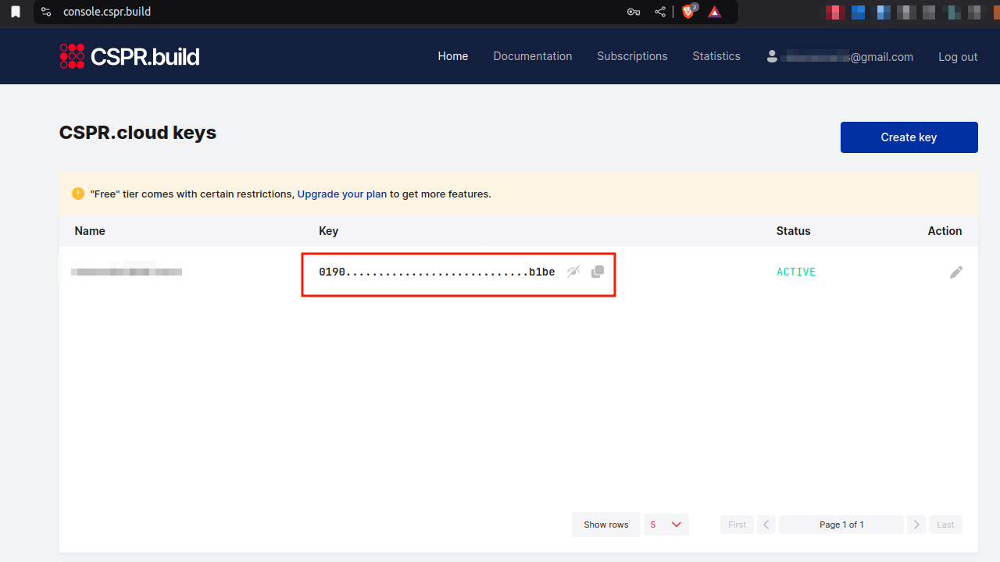

# cspr-cloud-example

## A Basic CSPR Cloud Integration Example Implementation

## Overview

This README provides detailed steps to clone the repository, set up the environment, and test the CSPR Cloud using a JavaScript example.

---

## Prerequisites

1. **Register on CSPR.build Console**
    
    - Sign up at [CSPR Console](https://console.cspr.build/sign-up) to create a CSPR.cloud access token.
    - For instance, this how your Dashboard will look like after you have successfully signed up and created a CSPR.cloud access token;

    


2. **Clone the Repository**
    
    ```bash
    git clone <repository-url>
    cd <repository-name>
    ```

3. **Initialise**
   - Initialise 
    
    `npm init`     

4. **Install Dependencies**
    
    - Install the following npm packages:
        
        ```bash
        npm install @open-rpc/client-js casper-js-sdk
        ```
        
5. **Create `index.js`**
    
    - Create an `index.js` file and copy the code from the SDK examples available at [SDK Examples](https://docs.cspr.cloud/casper-node-api/connecting-with-an-sdk#sdk-examples).
6. **Set Up the Environment File**
    
    - Create a `.env` file to manage environment parameters.
        
        ```bash
        touch .env
        npm install dotenv
        ```
        
    - Add the following to the `.env` file:
        
        ```env
        INTEGRATION_RPC_URL=https://node.integration.cspr.cloud/rpc
        TESTNET_RPC_URL=https://node.testnet.cspr.cloud/rpc
        MAINNET_RPC_URL=https://node.cspr.cloud/rpc
        AUTH_KEY=YOUR_AUTH_KEY
        ```
        
7. **Specify Endpoints**
    
    - Refer to the [Endpoints Documentation](https://docs.cspr.cloud/casper-node-api/connecting-with-an-sdk#endpoints) for additional endpoint details.
8. **Update the Code**
    
    - Use the appropriate endpoint and authorization key in `index.js`. For example:
        
        ```javascript
        require('dotenv').config();
        
        const customCasperClient = new CustomCasperClient(process.env.INTEGRATION_RPC_URL, {
            headers: {
                "Authorization": process.env.AUTH_KEY
            }
        });
        ```
        
9.  **Query a Deploy**
    
    - Use the Integration Network to query a deploy:
        1. Go to [Integration Deploys](https://integration.cspr.live/deploys).
        2. Select a Deploy Hash, e.g., `324e02c36fd0d98c577893a0370efdd2d7a08b6fcc15d4272bafd24005566127`.
        3. Update your `index.js` file with the deploy hash:
            
            ```javascript
            const deploy = await casperClient.getDeploy("324e02c36fd0d98c577893a0370efdd2d7a08b6fcc15d4272bafd24005566127");
            ```
            
        4. You can replace `getDeploy` with other RPC methods and pass the required parameters to fetch results from the respective RPC endpoints. Refer to the [RPC Methods Documentation](https://docs.cspr.cloud/) for more details.
10. **Run the Program**
    
    - Execute the program:
        
        ```bash
        node index.js
        ```
        
11. **View the Output**
    
    - The output will be displayed in the terminal. Example getDeploy output:
        
        ```json
            [
            {
                "approvals": [
                {
                    "signer": "020264c1067cfcd4a904a16986558994acc28baa3c501da15cf990802167f1d2c93c",
                    "signature": "02975c422551f5737904ca5da800321f49eaff186725c49bb4a5731a5933cc523f004b3cde50348298df0e1fc68d7ae61fbe70543482fdcd6a038986264e24d33a"
                }
                ],
                "session": {
                "transfer": {
                    "tag": 5,
                    "args": {
                    "args": {}
                    }
                }
                },
                "payment": {
                "moduleBytes": {
                    "tag": 0,
                    "moduleBytes": "",
                    "args": {
                    "args": {}
                    }
                }
                },
                "header": {
                "account": "0264c1067cfcd4a904a16986558994acc28baa3c501da15cf990802167f1d2c93c",
                "timestamp": 1734338377198,
                "ttl": 1800000,
                "gasPrice": 1,
                "bodyHash": "928309312897705c4d69f8befd94d0d0985010d523373f57f61964a2de5acc19",
                "dependencies": [],
                "chainName": "integration-test"
                },
                "hash": "324e02c36fd0d98c577893a0370efdd2d7a08b6fcc15d4272bafd24005566127"
            },
            {
                "api_version": "1.5.10",
                "deploy": {
                "hash": "324e02c36fd0d98c577893a0370efdd2d7a08b6fcc15d4272bafd24005566127",
                "header": {
                    "account": "020264c1067cfcd4a904a16986558994acc28baa3c501da15cf990802167f1d2c93c",
                    "timestamp": "2024-12-16T08:39:37.198Z",
                    "ttl": "30m",
                    "gas_price": 1,
                    "body_hash": "928309312897705c4d69f8befd94d0d0985010d523373f57f61964a2de5acc19",
                    "dependencies": [],
                    "chain_name": "integration-test"
                },
                "payment": {
                    "ModuleBytes": {
                    "module_bytes": "",
                    "args": [
                        [
                        "\"amount\"",
                        {
                            "cl_type": "U512",
                            "bytes": "0400e1f505",
                            "parsed": "100000000"
                        }
                        ]
                    ]
                    }
                },
                "session": {
                    "Transfer": {
                    "args": [
                        [
                        "\"amount\"",
                        {
                            "cl_type": "U512",
                            "bytes": "0400f90295",
                            "parsed": "2500000000"
                        }
                        ],
                        [
                        "\"target\"",
                        {
                            "cl_type": "PublicKey",
                            "bytes": "02027fec2d969dd0779358c40abe2a772f309408348c2a1f413fddfe684a4287ba1a",
                            "parsed": "02027fec2d969dd0779358c40abe2a772f309408348c2a1f413fddfe684a4287ba1a"
                        }
                        ],
                        [
                        "\"id\"",
                        {
                            "cl_type": {
                            "Option": "U64"
                            },
                            "bytes": "0175599fce93010000",
                            "parsed": 1734338369909
                        }
                        ]
                    ]
                    }
                },
                "approvals": [
                    {
                    "signer": "020264c1067cfcd4a904a16986558994acc28baa3c501da15cf990802167f1d2c93c",
                    "signature": "02975c422551f5737904ca5da800321f49eaff186725c49bb4a5731a5933cc523f004b3cde50348298df0e1fc68d7ae61fbe70543482fdcd6a038986264e24d33a"
                    }
                ]
                },
                "execution_results": [
                {
                    "block_hash": "c8861fec264471feb54fbf6059d8ee075bb8cbecd8269645689ef2ebe65baf24",
                    "result": {
                    "Success": {
                        "effect": {
                        "operations": [],
                        "transforms": [
                            {
                            "key": "account-hash-6174cf2e6f8fed1715c9a3bace9c50bfe572eecb763b0ed3f644532616452008",
                            "transform": "Identity"
                            },
                            {
                            "key": "hash-d2dfc9409965993f9e186db762b585274dcafe439fa1321cfca08017262c8e46",
                            "transform": "Identity"
                            },
                            {
                            "key": "account-hash-b85634e0695ac3b6a7792c2009377b4a405118571a9c64ab2c66048250fef36c",
                            "transform": "Identity"
                            },
                            {
                            "key": "account-hash-b85634e0695ac3b6a7792c2009377b4a405118571a9c64ab2c66048250fef36c",
                            "transform": "Identity"
                            },
                            {
                            "key": "hash-d2dfc9409965993f9e186db762b585274dcafe439fa1321cfca08017262c8e46",
                            "transform": "Identity"
                            },
                            {
                            "key": "hash-d2dfc9409965993f9e186db762b585274dcafe439fa1321cfca08017262c8e46",
                            "transform": "Identity"
                            },
                            {
                            "key": "hash-0a300922655180354a9ee92b808c7b45b08e5b01d9da0bac9a9b3415bcebbf8d",
                            "transform": "Identity"
                            },
                            {
                            "key": "hash-d2dfc9409965993f9e186db762b585274dcafe439fa1321cfca08017262c8e46",
                            "transform": "Identity"
                            },
                            {
                            "key": "hash-f8df015ba26860a7ec8cab4ee99f079325b0bbb9ef0e7810b63d85df39da95fe",
                            "transform": "Identity"
                            },
                            {
                            "key": "hash-f8df015ba26860a7ec8cab4ee99f079325b0bbb9ef0e7810b63d85df39da95fe",
                            "transform": "Identity"
                            },
                            {
                            "key": "hash-59c6451dd58463708fa0b122e97114f07fa5f609229c9d67ac9426935416fbeb",
                            "transform": "Identity"
                            },
                            {
                            "key": "hash-f8df015ba26860a7ec8cab4ee99f079325b0bbb9ef0e7810b63d85df39da95fe",
                            "transform": "Identity"
                            },
                            {
                            "key": "balance-e7859628837f9fd13e72c8eadbb4968496e7a994e0575a4b390b690f509cde47",
                            "transform": "Identity"
                            },
                            {
                            "key": "balance-ea3c9bdcbe57f067a29609d397981b2d0fb39853a0a9f06e444b06404eadcb1a",
                            "transform": "Identity"
                            },
                            {
                            "key": "balance-e7859628837f9fd13e72c8eadbb4968496e7a994e0575a4b390b690f509cde47",
                            "transform": {
                                "WriteCLValue": {
                                "cl_type": "U512",
                                "bytes": "0500f3ee058b",
                                "parsed": "597100000000"
                                }
                            }
                            },
                            {
                            "key": "balance-ea3c9bdcbe57f067a29609d397981b2d0fb39853a0a9f06e444b06404eadcb1a",
                            "transform": {
                                "AddUInt512": "100000000"
                            }
                            },
                            {
                            "key": "account-hash-6174cf2e6f8fed1715c9a3bace9c50bfe572eecb763b0ed3f644532616452008",
                            "transform": "Identity"
                            },
                            {
                            "key": "hash-d2dfc9409965993f9e186db762b585274dcafe439fa1321cfca08017262c8e46",
                            "transform": "Identity"
                            },
                            {
                            "key": "account-hash-b85634e0695ac3b6a7792c2009377b4a405118571a9c64ab2c66048250fef36c",
                            "transform": "Identity"
                            },
                            {
                            "key": "account-hash-b85634e0695ac3b6a7792c2009377b4a405118571a9c64ab2c66048250fef36c",
                            "transform": "Identity"
                            },
                            {
                            "key": "hash-d2dfc9409965993f9e186db762b585274dcafe439fa1321cfca08017262c8e46",
                            "transform": "Identity"
                            },
                            {
                            "key": "hash-d2dfc9409965993f9e186db762b585274dcafe439fa1321cfca08017262c8e46",
                            "transform": "Identity"
                            },
                            {
                            "key": "hash-0a300922655180354a9ee92b808c7b45b08e5b01d9da0bac9a9b3415bcebbf8d",
                            "transform": "Identity"
                            },
                            {
                            "key": "hash-d2dfc9409965993f9e186db762b585274dcafe439fa1321cfca08017262c8e46",
                            "transform": "Identity"
                            },
                            {
                            "key": "hash-f8df015ba26860a7ec8cab4ee99f079325b0bbb9ef0e7810b63d85df39da95fe",
                            "transform": "Identity"
                            },
                            {
                            "key": "hash-f8df015ba26860a7ec8cab4ee99f079325b0bbb9ef0e7810b63d85df39da95fe",
                            "transform": "Identity"
                            },
                            {
                            "key": "hash-59c6451dd58463708fa0b122e97114f07fa5f609229c9d67ac9426935416fbeb",
                            "transform": "Identity"
                            },
                            {
                            "key": "hash-f8df015ba26860a7ec8cab4ee99f079325b0bbb9ef0e7810b63d85df39da95fe",
                            "transform": "Identity"
                            },
                            {
                            "key": "balance-e7859628837f9fd13e72c8eadbb4968496e7a994e0575a4b390b690f509cde47",
                            "transform": "Identity"
                            },
                            {
                            "key": "balance-ea3c9bdcbe57f067a29609d397981b2d0fb39853a0a9f06e444b06404eadcb1a",
                            "transform": "Identity"
                            },
                            {
                            "key": "balance-e7859628837f9fd13e72c8eadbb4968496e7a994e0575a4b390b690f509cde47",
                            "transform": {
                                "WriteCLValue": {
                                "cl_type": "U512",
                                "bytes": "0500f3ee058b",
                                "parsed": "597100000000"
                                }
                            }
                            },
                            {
                            "key": "balance-ea3c9bdcbe57f067a29609d397981b2d0fb39853a0a9f06e444b06404eadcb1a",
                            "transform": {
                                "AddUInt512": "100000000"
                            }
                            },
                            {
                            "key": "hash-f8df015ba26860a7ec8cab4ee99f079325b0bbb9ef0e7810b63d85df39da95fe",
                            "transform": "Identity"
                            },
                            {
                            "key": "hash-f8df015ba26860a7ec8cab4ee99f079325b0bbb9ef0e7810b63d85df39da95fe",
                            "transform": "Identity"
                            },
                            {
                            "key": "hash-59c6451dd58463708fa0b122e97114f07fa5f609229c9d67ac9426935416fbeb",
                            "transform": "Identity"
                            },
                            {
                            "key": "hash-f8df015ba26860a7ec8cab4ee99f079325b0bbb9ef0e7810b63d85df39da95fe",
                            "transform": "Identity"
                            },
                            {
                            "key": "balance-e7859628837f9fd13e72c8eadbb4968496e7a994e0575a4b390b690f509cde47",
                            "transform": "Identity"
                            },
                            {
                            "key": "balance-9f8cdcabb1552d8c92053382294523f5cac0b3ea508eaedac55c8f0fdf67e11f",
                            "transform": "Identity"
                            },
                            {
                            "key": "balance-e7859628837f9fd13e72c8eadbb4968496e7a994e0575a4b390b690f509cde47",
                            "transform": {
                                "WriteCLValue": {
                                "cl_type": "U512",
                                "bytes": "0500faeb708a",
                                "parsed": "594600000000"
                                }
                            }
                            },
                            {
                            "key": "balance-9f8cdcabb1552d8c92053382294523f5cac0b3ea508eaedac55c8f0fdf67e11f",
                            "transform": {
                                "AddUInt512": "2500000000"
                            }
                            },
                            {
                            "key": "transfer-ec092a3b9e01f2503ff654c432726d15952ded4a469415da62459ab547779469",
                            "transform": {
                                "WriteTransfer": {
                                "deploy_hash": "324e02c36fd0d98c577893a0370efdd2d7a08b6fcc15d4272bafd24005566127",
                                "from": "account-hash-bb0e45e4f8fa09731bf1b58407e4d5272060d5a4c2120393fd072cb383785a02",
                                "to": "account-hash-b85634e0695ac3b6a7792c2009377b4a405118571a9c64ab2c66048250fef36c",
                                "source": "uref-e7859628837f9fd13e72c8eadbb4968496e7a994e0575a4b390b690f509cde47-007",
                                "target": "uref-9f8cdcabb1552d8c92053382294523f5cac0b3ea508eaedac55c8f0fdf67e11f-004",
                                "amount": "2500000000",
                                "gas": "0",
                                "id": 1734338369909
                                }
                            }
                            },
                            {
                            "key": "deploy-324e02c36fd0d98c577893a0370efdd2d7a08b6fcc15d4272bafd24005566127",
                            "transform": {
                                "WriteDeployInfo": {
                                "deploy_hash": "324e02c36fd0d98c577893a0370efdd2d7a08b6fcc15d4272bafd24005566127",
                                "transfers": [
                                    "\"transfer-ec092a3b9e01f2503ff654c432726d15952ded4a469415da62459ab547779469\""
                                ],
                                "from": "account-hash-bb0e45e4f8fa09731bf1b58407e4d5272060d5a4c2120393fd072cb383785a02",
                                "source": "uref-e7859628837f9fd13e72c8eadbb4968496e7a994e0575a4b390b690f509cde47-007",
                                "gas": "100000000"
                                }
                            }
                            },
                            {
                            "key": "hash-d2dfc9409965993f9e186db762b585274dcafe439fa1321cfca08017262c8e46",
                            "transform": "Identity"
                            },
                            {
                            "key": "hash-d2dfc9409965993f9e186db762b585274dcafe439fa1321cfca08017262c8e46",
                            "transform": "Identity"
                            },
                            {
                            "key": "hash-0a300922655180354a9ee92b808c7b45b08e5b01d9da0bac9a9b3415bcebbf8d",
                            "transform": "Identity"
                            },
                            {
                            "key": "hash-d2dfc9409965993f9e186db762b585274dcafe439fa1321cfca08017262c8e46",
                            "transform": "Identity"
                            },
                            {
                            "key": "balance-ea3c9bdcbe57f067a29609d397981b2d0fb39853a0a9f06e444b06404eadcb1a",
                            "transform": "Identity"
                            },
                            {
                            "key": "hash-d2dfc9409965993f9e186db762b585274dcafe439fa1321cfca08017262c8e46",
                            "transform": "Identity"
                            },
                            {
                            "key": "hash-f8df015ba26860a7ec8cab4ee99f079325b0bbb9ef0e7810b63d85df39da95fe",
                            "transform": "Identity"
                            },
                            {
                            "key": "hash-59c6451dd58463708fa0b122e97114f07fa5f609229c9d67ac9426935416fbeb",
                            "transform": "Identity"
                            },
                            {
                            "key": "hash-f8df015ba26860a7ec8cab4ee99f079325b0bbb9ef0e7810b63d85df39da95fe",
                            "transform": "Identity"
                            },
                            {
                            "key": "balance-ea3c9bdcbe57f067a29609d397981b2d0fb39853a0a9f06e444b06404eadcb1a",
                            "transform": "Identity"
                            },
                            {
                            "key": "balance-f18838ea4e022c2a805301cd1fa6fe5117ac0d98a51d46f5724b28b815f6c587",
                            "transform": "Identity"
                            },
                            {
                            "key": "balance-ea3c9bdcbe57f067a29609d397981b2d0fb39853a0a9f06e444b06404eadcb1a",
                            "transform": {
                                "WriteCLValue": {
                                "cl_type": "U512",
                                "bytes": "00",
                                "parsed": "0"
                                }
                            }
                            },
                            {
                            "key": "balance-f18838ea4e022c2a805301cd1fa6fe5117ac0d98a51d46f5724b28b815f6c587",
                            "transform": {
                                "AddUInt512": "100000000"
                            }
                            }
                        ]
                        },
                        "transfers": [
                        "\"transfer-ec092a3b9e01f2503ff654c432726d15952ded4a469415da62459ab547779469\""
                        ],
                        "cost": "100000000"
                    }
                    }
                }
                ]
            }
            ]
        ```